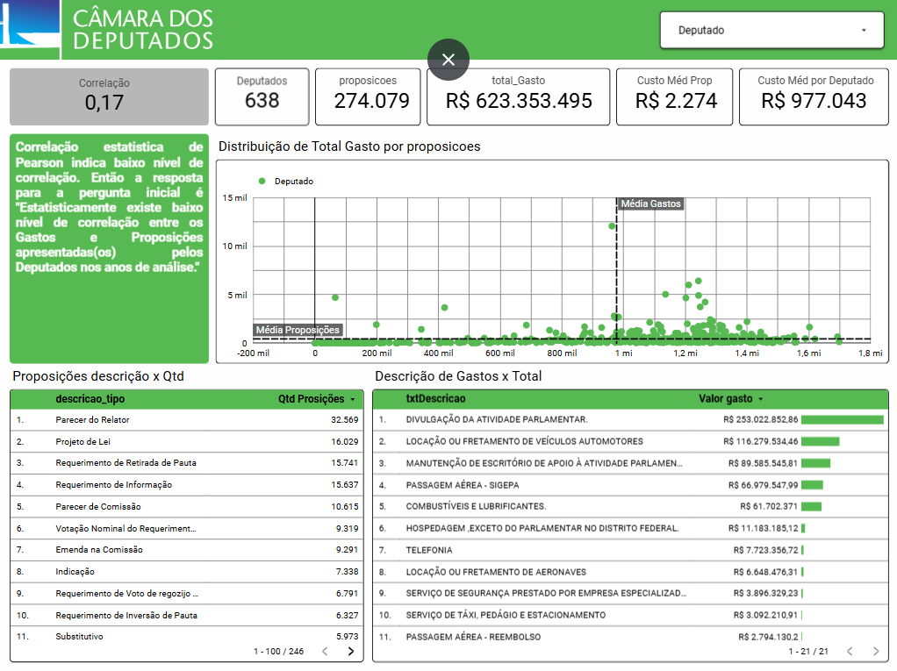

# Gastos vs Atividades Parlamentares

Pipeline de dados que coleta os dados abertos da Câmara dos Deputados, transforma e carrega no Google BigQuery, e alimenta um dashboard no Looker Studio sobre a relação entre gastos com a cota parlamentar e a atividade legislativa dos deputados.


## Pergunta do projeto

> Existe relação entre quanto um deputado gasta com a cota parlamentar e quantas proposições ele apresenta?

Os gráficos do dashboard respondem essa pergunta em camadas, do resumo ao detalhe:

| Elemento | O que mostra | Como responde a pergunta |
|---|---|---|
| **Correlação (0,17)** | Coeficiente de Pearson entre total gasto e número de autorias por deputado | Resposta direta: a correlação é fraca |
| **Texto explicativo** | Interpretação do coeficiente | Traduz 0,17 em linguagem simples |
| **Deputados, proposições, total gasto** | Volume geral: 638 deputados, 274.079 autorias, R$ 623 milhões gastos | Dá escala aos números seguintes |
| **Custo médio por proposição e por deputado** | Total gasto dividido por autorias e por deputado | Mostra quanto custa, em média, cada autoria e cada deputado |
| **Distribuição de Total Gasto por proposições** | Gráfico de dispersão: cada ponto é um deputado; as linhas tracejadas são as médias | Permite ver a correlação com os próprios dados. A maioria dos deputados fica concentrada perto da média de proposições e com gastos baixos, e poucos casos fogem do padrão |
| **Proposições descrição x Qtd** | Quantidade de cada tipo de proposição (projeto de lei, parecer, requerimento etc.) | Mostra o tipo de atividade legislativa produzida, que é o outro lado da comparação |
| **Descrição de Gastos x Total** | Categorias de gasto (passagens, combustíveis, locação de veículos etc.) e o valor de cada uma | Mostra para onde vai o dinheiro, que é o lado dos gastos da comparação |

**Período dos dados:** os dados foram obtidos para os anos definidos no código, na chamada do flow (`pipeline_legislativo(anos=[...])`). Até 4 anos podem ser carregados por execução.

## Dashboard



**Leitura:** a correlação de 0,17 indica baixo nível de relação linear entre gastos e autorias. Ou seja, deputados que gastam mais não apresentam necessariamente mais proposições. Como o cálculo usa 638 deputados, alguns casos extremos influenciam o valor (ver [Limitações](#limitações-conhecidas)).

## Arquitetura

```
API Dados Abertos (Câmara)
        │
        ▼
Download (requests, cache de 24h)
        │
        ▼
Extração (pandas, separador ;)
        │
        ▼
Transformação (seleção, tipos, nulos, IDs)
        │
        ▼
União dos anos (até 4 por execução)
        │
        ▼
BigQuery: 4 tabelas  ──►  4 views de análise  ──►  Looker Studio
```

A orquestração é feita com **Prefect 2**. Os datasets são descritos em `tasks/scripts/config.py`, então adicionar uma nova fonte é, em grande parte, adicionar uma entrada na configuração.

## Dados

| Tabela | Fonte | Granularidade | Coluna `ano` | Observação |
|---|---|---|---|---|
| `proposicoes` | `proposicoes-{ano}.csv` | Uma linha por proposição | Sim | `dataApresentacao` convertida para DATE |
| `proposicoes_autores` | `proposicoesAutores-{ano}.csv` | Uma linha por autor por proposição | Sim | Não tem data própria; o ano vem da carga |
| `gastos_parlamentares` | `Ano-{ano}.csv.zip` | Uma linha por despesa | Sim | `vlrLiquido` em NUMERIC (precisão financeira) |
| `deputados` | `deputados.csv` | Um deputado | Não | Arquivo único, baixado uma vez por execução |

A coluna `ano` é adicionada à seleção de cada dataset anual, então é possível filtrar por período mesmo depois da união dos anos.

## Views no BigQuery

As views ficam no BigQuery e refletem sempre a última carga das tabelas. As definições estão em [`sql/views.sql`](sql/views.sql).

| View | O que faz | Usada em |
|---|---|---|
| `vw_deputados_resumo` | Por deputado: total gasto e número de autorias | Base da correlação e dos custos médios |
| `vw_correlacao_kpi` | Correlação de Pearson entre total gasto e autorias | Card de correlação |
| `vw_gastos_com_join` | Gastos com o nome do deputado | Tabela de gastos por descrição |
| `vw_proposicoes_com_join` | Autorias com a descrição do tipo da proposição | Tabela de proposições por tipo |

## Métricas do dashboard

| Card | Cálculo |
|---|---|
| Deputados | Número de deputados em `vw_deputados_resumo` |
| Proposições | Total de autorias de deputados (linhas de `proposicoes_autores` com `idDeputadoAutor`). Um projeto com 3 autores conta 3 |
| Total gasto | Soma de `vlrLiquido` |
| Custo médio por proposição | Total gasto ÷ autorias |
| Custo médio por deputado | Total gasto ÷ deputados |
| Correlação | `CORR(total_Gasto, proposicoes)` em `vw_correlacao_kpi` |

## Como executar

Todo o ambiente roda em **Docker**. Você não precisa instalar Python nem as bibliotecas do projeto na sua máquina.

### Pré-requisitos

- [Docker Desktop](https://www.docker.com/products/docker-desktop/) instalado e em execução
- Projeto no Google Cloud com a API do BigQuery habilitada
- Arquivo JSON de uma service account com as permissões **BigQuery Data Editor** e **BigQuery Job User**

### Passo a passo

**1. Coloque a credencial no projeto**

Salve o JSON da service account em `gcp/credenciais.json`. Esse arquivo não é versionado.

**2. Configure as variáveis**

```bash
cp .env.docker.example .env.docker
```

Edite `.env.docker` com o seu projeto e dataset:

```bash
BQ_PROJECT=seu-projeto-gcp
BQ_DATASET=desafio_legislativo_2026
```

**3. Suba os contêineres**

```bash
docker-compose up -d
```

**4. Acompanhe a execução**

Abra http://localhost:4200 para ver o flow no Prefect.

**5. Crie as views**

Execute `sql/views.sql` no console do BigQuery, de cima para baixo.

**6. Para encerrar**

```bash
docker-compose down
```

### O que é instalado no Docker

- **Imagem oficial do Prefect Server:** interface e API de orquestração.
- **Imagem do projeto** (Python 3.11), com as bibliotecas de `requirements.txt`: pandas, pandas-gbq, pyarrow, prefect, google-cloud-bigquery e requests.

### Execução sem Docker (desenvolvimento)

Para quem quer rodar o código direto na máquina, é preciso Python 3.10 ou 3.11:

```bash
python -m venv .venv
.venv\Scripts\activate        # Windows
# source .venv/bin/activate   # Linux/Mac

pip install -r requirements.txt

cd tasks
python -c "from main_prefect import pipeline_legislativo; pipeline_legislativo(anos=['2025', '2026'])"
```

Nesse modo, é preciso definir `GOOGLE_APPLICATION_CREDENTIALS` com o caminho absoluto do JSON, além de `BQ_PROJECT` e `BQ_DATASET`. Use o `.env.example` como modelo.

### Testes

```bash
pip install pytest pytest-cov
pytest -v
```

Os testes não acessam a internet nem o BigQuery. Download, `requests` e `to_gbq` são substituídos por mocks. O `get_run_logger()` do Prefect também é substituído nos testes, por uma fixture em `tests/conftest.py`.

A cada `push` e `pull request`, o GitHub Actions roda os testes em Python 3.10 e 3.11 (`.github/workflows/ci.yml`).

## Por que carga completa e não incremental

O pipeline recria as tabelas inteiras a cada execução (`if_exists="replace"`), em vez de acrescentar só o que é novo. Isso é uma decisão deliberada, e o motivo é que os dados mudam depois de publicados:

- **Campos de status mudam.** Em `proposicoes`, campos como `ultimoStatus_descricaoSituacao` e `ultimoStatus_dataHora` são atualizados conforme a proposição tramita. Uma proposição de 2025 pode ter situação diferente hoje.
- **Anos passados também mudam.** Um arquivo de um ano já encerrado pode receber correções ou novos registros. Por isso o pipeline não trata um ano antigo como imutável.
- **Consistência.** Recarregar tudo garante que as tabelas e as views reflitam a mesma versão dos dados. Uma carga incremental poderia misturar registros de versões diferentes.

A contrapartida é que toda execução reescreve todas as linhas dos anos informados. Por isso o limite é de 4 anos por execução, e o custo cresce com o volume. Também significa que **a execução define o conjunto de anos da tabela**: rodar só `anos=["2026"]` remove 2025 das tabelas. Para manter vários anos, a execução precisa informar todos eles.

Se o volume crescer, a evolução natural é carregar anos antigos apenas quando houver mudança, usando uma coluna de data de atualização como critério.

## Decisões técnicas

- **Configuração declarativa.** Cada dataset define URL, arquivo, tabela, schema e etapas de transformação. O flow não tem lógica específica por dataset.
- **Transformações reutilizáveis.** Funções genéricas (`converter_data`, `normalizar_nulos`, `extrair_id`, etc.) são combinadas por dataset em `steps_transform.py`.
- **Cache de download de 24 horas.** A Câmara atualiza os dados diariamente, então baixar o mesmo arquivo mais de uma vez por dia não traz nenhuma informação nova. Com 24 horas, cada arquivo é baixado no máximo uma vez por dia. A contrapartida é que uma execução pode usar dados de até um dia antes da publicação. Arquivo vazio nunca conta como válido, para que um download interrompido não seja reaproveitado.
- **Validação antes do envio.** Cada coluna é convertida pelo PyArrow antes da carga. Um tipo inconsistente falha com o nome da coluna, em vez de falhar no meio do envio ao BigQuery.
- **Credenciais sob demanda.** O arquivo da service account só é lido na hora da carga, então importar o módulo ou rodar os testes não exige credenciais.
- **Decimais em NUMERIC.** Valores financeiros são convertidos para `Decimal` e gravados como NUMERIC, sem arredondamento de ponto flutuante.
- **Views em vez de tabelas agregadas.** As análises são calculadas sob demanda, então o dashboard sempre reflete a última carga.

## Limitações conhecidas

- **Junções internas.** `vw_deputados_resumo` e `vw_gastos_com_join` usam `JOIN`. Deputados sem gasto, ou gastos cujo `ideCadastro` não corresponde a nenhum deputado, ficam fora das análises.
- **"Proposições" são autorias.** O card conta linhas de autoria, não proposições distintas. Um projeto com vários autores aparece várias vezes.
- **Pearson é sensível a outliers.** A correlação de 0,17 é calculada sobre 638 deputados, e alguns casos extremos pesam no resultado. Uma correlação de Spearman (baseada em postos) seria menos afetada por eles.
- **Dependência do formato da Câmara.** Se a API mudar nomes ou ordem de colunas, o pipeline falha. As seleções são explícitas, então o erro aparece logo na transformação.

## Estrutura do projeto

```
legislativo_etl/
├── .github/workflows/ci.yml     # CI: testes em 3.10 e 3.11
├── docs/
│   └── dashboard.png            # captura do dashboard
├── gcp/
│   └── credenciais.json         # não versionado
├── sql/
│   └── views.sql                # definição das views no BigQuery
├── tasks/
│   ├── main_prefect.py          # flow principal
│   └── scripts/
│       ├── config.py            # datasets, variáveis de ambiente, limite de anos
│       ├── download.py          # download, ZIP e cache
│       ├── pipeline.py          # extração, união e carga no BigQuery
│       ├── schemas.py           # schemas das tabelas no BigQuery
│       ├── steps_transform.py   # sequência de transformações por dataset
│       └── transform.py         # funções de transformação
├── tests/                       # testes unitários com mocks
├── .dockerignore
├── .env.docker.example
├── .env.example
├── Dockerfile
├── docker-compose.yml
├── pytest.ini
├── requirements.txt
└── README.md
```

## Próximos passos

- Agendamento diário no Prefect, para atualizar os dados sem execução manual
- Validação dos dados após a carga (contagem mínima de linhas, nulos em `id`)
- Carga incremental com critério de data de atualização, se o volume crescer
- Modelagem das views com dbt

## Autor

Vinicius Lemos ([@Vinill2](https://github.com/Vinill2))